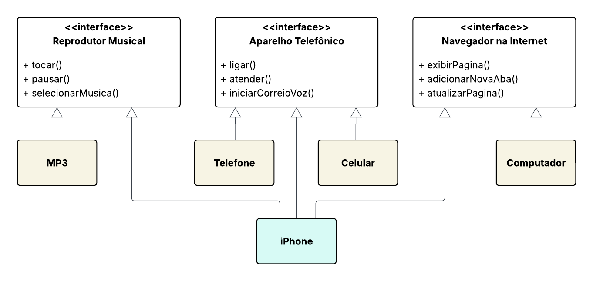

# Modelando o iPhone com UML: Funções de Músicas, Chamadas e Internet

O objetivo desse desafio foi montar um diagrama de classes e interfaces de um iPhone e desenvolver o código em Java.

### Interfaces desenvolvidas:
- Reprodutor Musical
- Aparelho Telefônico
- Navegador na Internet

## Diagrama

